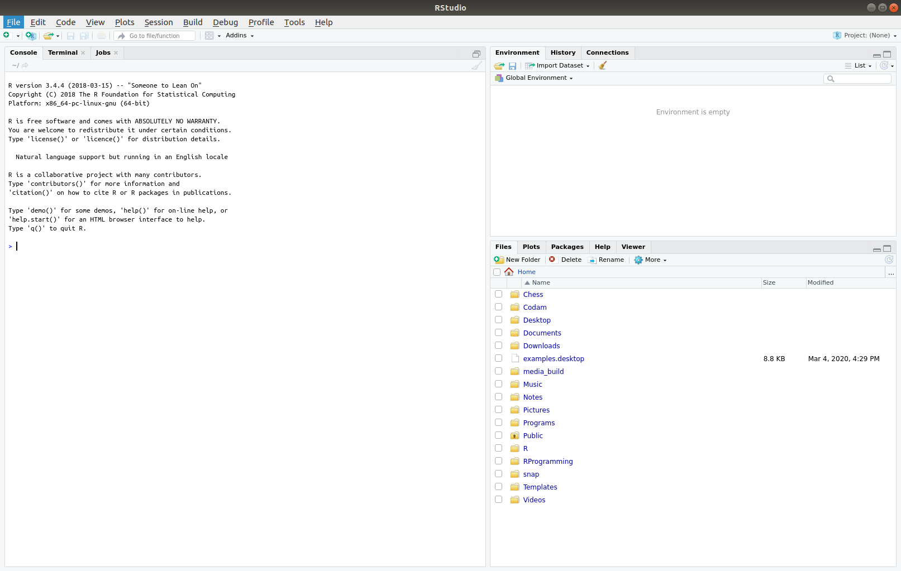

# Chapter 2: Vectors, and RStudio

### Introducing Data structures: Vectors

Many **data structures** exist within R, they form the backbone of R. It is
absolutely vital to ensure that all of your data in R is organised correctly
into appropriate data structures, as this will make it far easier to analyse
your data correctly.

**Vectors** are the most common and the most basic data structure in R. A
vector is essentially a **list** or **array** of different values (or elements),
all grouped together. There are two types of vectors:

* Atomic vectors - All elements in the vector have the same type.
* Lists - Different types of elements are grouped together.

The term 'vector' is most commonly used to refer to atomic vectors.

We actually came across a vector in chapter 1, when running the `ls()` command,
a **list** was returned of all the variables declared in our environment.

To create our own vector, we can use the command `vector()`. `help(vector)` will
give us some more information about the command:

```
Description: 'vector' produces a vector of the given length and mode.

Usage:	vector(mode = "logical", length = 0)
```

So `vector()` can take up to two arguments, specifying `mode` and `length`. The
`mode` defines the **type** of variables our vector will store, and `length`
defines how long our vector is. With no arguments, `vector()` will default to
a logical vector of length 0, as we can see by entering the function into our
console:

```
> vector()
logical(0)
```

If we specify the `mode`:

```
> vector("character")
character(0)
```

And if we specify `mode` and `length`:

```
> vector("character", 5)
[1] "" "" "" "" ""
```

Each pair of double-quotes represents an empty string, containing 0
characters.

> A small note on supply arguments to functions. If we would like to make our
> function calls even more explicit, we *can* name our arguments as we supply
> them using an '=' sign.
>
> ```
> vector(mode = "character", length = 5)
> [1] "" "" "" "" ""
> ```
>
> When we do this, we can also supply our arguments in any order we like, and
> the function will be interpreted correctly:
>
> ```
> vector(length = 5, mode = "character")
> [1] "" "" "" "" ""
> ```
>
> It is up to you how you write your function calls, however I would personally
> recommend the implicit supply of arguments for common functions, with explicit
> supply when using more specialised functions - to improve the readability of
> your code.

Using the vector function in this way is going to create and output a vector,
if we want to store it however we must assign it to a variable, as before with
our simple variables:

```
> vector1 <- vector("character", 3)
> vector1
[1] "" "" ""
```

> An interesting note on vectors and variables: R does not actually have primitive
> data types (such as an integer, or a character type), the most basic data type
> in R is actually a vector, and the variables we declared in chapter 1 were all
> vectors with a length of 1. This is why our output is always preceded by
> a '[1]', the '1' is there to inform us that this line of the vector begins
> with the 1st element of the vector. To demonstrate this, try creating and
> reading the following vector:
> ```
> > vectorX <- vector(mode = "character", 50)
> > vectorX
> [1] "" "" "" "" "" "" "" "" "" "" "" "" "" "" "" "" "" "" "" "" "" "" "" "" "" 
> [26] "" "" "" "" "" "" "" "" "" "" "" "" "" "" "" "" "" "" "" "" "" "" "" "" ""
> ```
> In the above vector, the [26] informs us that the first element in this line
> of output was the 26th element of the vector.

### Direct construction of vectors

While it is perfectly fine to use the `vector()` function for all our vectors,
it is more common to use **direct constructor** functions:

* `logical(length = 0)`
* `character(length = 0)`
* `numeric(length = 0)`

With the following results:

```
> character(5)
[1] "" "" "" "" ""
> numeric(5)
[1] 0 0 0 0 0
> logical(5)
[1] FALSE FALSE FALSE FALSE FALSE
```

Vectors can also be created with their content specified, using the `c()`
function. R will guess the appropriate mode of storage based on the values
within:

```
> vector2 <- c(1, 2, 3)
> typeof(vector2)
[1] "double"
> vector3 <- c(TRUE, FALSE, TRUE, FALSE, TRUE)
> typeof(vector3)
[1] "logical"
> vector4 <- c("Alex", "Andrew", "Rebecca")
> typeof(vector4)
[1] "character"
```

> To make a vector using integers instead of doubles, we could either append an
> 'L' to the end of every single value, or use the `as.integer()` function on
> the entire vector.
> ```
> > vector5 <- as.integer(c(1, 2, 3, 4, 5, 6))
> > typeof(vector5)
> [1] "integer"
> ```

### Examining Vectors

Other functions that can give you useful information about vectors and other
R objects are `length()`, `class()` and `str()`.

* `length()` - returns length of an object.
* `class()` - While `typeof()` returns information about an objects most
primitive type, classes are more complex types that we can construct ourselves,
and we will study these in more detail in a later chapter.
* `str()` - returns information about the **structure** of an object. While it
seems a little redundant for our vectors - this will be very useful when we move
onto more complex data structures.

Try the functions out on some of your variables in the R console, to
familiarise yourself with the methods for determining the nature of a variable.

### Installing RStudio

By now you should be starting to feel somewhat comfortable with the R console,
and have a basic understanding of the fundamental data structure: the vector.
Now we are going to install RStudio, cover the basics of its layout, and
perform a very simple statistical analysis.

To install RStudio, head to the
[RStudio website](https://rstudio.com/products/rstudio/download/) and choose
the version appropriate to your OS.

After downloading and installing, opening RStudio should result in a screen
like this:



There are 3 major sections of the screen, with multiple tabs. Following are
the most important tabs for us:

* The left-hand side of the screen is an R console - just like the one we have
been using previously. If we enter commands here, we will see exactly the
same result as we did when we were using the R console alone.
* The top-right hand side of the screen contains a list of the current working
environment. Try declaring some variables in the R console on the left hand
side, and you should see the variables appear in this window - along with
a description of their structure (as you would get from using the `str()`
command).
* Also in the top-right corner is a tab for history. This simply shows the
history of commands entered into the R console, and may be useful from time to
time.
* In the lower-right corner is an outline of our filesystem - this can be
useful for finding files to load into RStudio, such as R scripts, which we will
learn more about soon.
* Also in the lower-right corner, is a tab labeled "plots". This will be blank
initially, but when we start using graphical functions to plot graphs and
charts, our output will appear here, where it can be exported into an image
file.
* Also in the lower-right: the 'Packages' tab. This will be of the utmost
importance if you want to perform complicated analyses with ease. The currently
loaded packages will have their checkboxes selected - we can see other packages
that are not currently loaded, and are able to install more packages using the
'install' button.

#### A brief note on Packages

R comes with a number of built-in functions - several of which we have already
used (`ls()`, `vector()`, etc.) - but there are a number of incredibly
useful functions that other people have written, and shared with the world.
To use these functions, all we have to do is install the 'package' that they
have released, and load it into our R environment. We will do this several
times later in this tutorial.

> Other tabs
> 
> * The left-hand side of the screen also contains a terminal - if you are
> experienced in using a terminal then this can be useful for a quick command, 
> but it may be easier to simply use a different window for a terminal - and this
> tab is not important for our purposes.
> * The bottom-right of RStudio also contains a tab labelled 'Help', containing
> links to online help pages. These can often be useful as a reference.

### Writing and executing our first R script

At the end of the previous chapter, we concluded that R could function
excellently as a very powerful calculator. However it would obviously be
extremely annoying to have to enter the values of variables we want to use
everytime we want to perform an analysis - and ridiculous when using large
sets of data.

An **R Script**, put simply, is a series of commands that we can write, and
instead of having to enter the commands one at a time into the Console R will
execute everything in our script itself. It also makes it very easy to share
analyses with others, by simply sending a script anybody can see every step of
your analysis.

To create an R script from RStudio, we can open a new script from the 'File'
tab on the toolbar at the top left, or click the button beneath it. When this
is done, the top left of the screen will open a text editor - this is where
we can write our scripts.

Good practice to start an R script is to include a title at the top using
**comments** - comments are text within the script that is entirely ignored by
the R console when the script is run, and serve to describe your code. We
write a comment using a `#`.

```
# BasicStats.R
```

Our first script is going to be extremely simple: we're going to declare a
vector `got_season1`, which contains the IMDB ratings of each episode of
Game of Thrones. Then, we're going to declare a new variable: `got_season1_mean`
, calculated by using the `mean()` function on our previous vector. Finally,
we will print our results to the screen with the `print()` function.

```
got_season1 <- c(9.1, 8.8, 8.7, 8.8, 9.1, 9.2, 9.2, 9, 9.6, 9.5)
got_season1_mean <- mean(got_season1)
print(got_season1_mean)
```

RStudio runs it's code in a slightly odd way, the default 'Run' button
above the script will run only the current line of code. To run the entirety
of the script, we use **Source**. This will send a command to the R Console:

```
source('~/path/to/your/directory/BasicStats.R', echo=TRUE)
```

> We can see this command in the 'History' tab of RStudio

Once run, we should see from the RStudio console at the bottom left, that all
of our lines were entered into the console one by one. Our variables will be
present in the environment, as we can see on the top right corner - and our
result will be printed on the screen: `[1] 9.1`.

> The reason why we are seeing every line of the script is because the argument
> `echo` is set to `TRUE` in the `source()` command used by RStudio by default.
> If you run the same command with `echo=FALSE`, or without the `echo` argument
> supplied at all (as it defaults to FALSE), then you will see only the output
> of the program - the result of our `print()` statement. You can run with echo
> OFF by clicking the small arrow on the 'Source' button.

Now, let's add a couple more basic functions:

* range(vector) - return a vector of length two, with the minimum and maximum
values from the vector.
* diff(vector) - returns a vector containing the differences between every
pair of elements in the argument vector.
* median(vector) - find the middle most value. If the argument vector is even
in length, return the midpoint between the two middle values.

> There is no default function to determine **mode** of a vector - the value
> that occurs the most times in a vector. We will instead create our own
> function to do this in a later section.

To get the median rating for season 1, we can simply call the `median()`
function on our vector:

```
got_season1_median <- median(got_season1)
print(got_season1_median)
```

To determine the exact number for **range**, we must run two functions on our
data: `range()` first to get the min and max values, then `diff()` on this
result to get the difference between them. This can be done in a single line
by using the first function **as an argument** for the second function, as seen
below:

```
got_season1_range <- diff(range(got_season1))
print(got_season1_range)
```

Now, if we `source()` our script, we should see the following output:

```
[1] 9.1
[1] 9.1
[1] 0.9
```

### Chapter 2 Conclusion

Using the information from this chapter, you should:

* Understand how to create simple vectors.
* Know the difference between vector types.
* Know basic functions for examining a vector in the console.
* Be familiar with the layout of RStudio.
* Know how to write and execute an R script.

Understanding vectors is crucial to understanding R. In later chapters
we will begin to construct more complex data structures - matrices, lists, and
data frames - but they all have their roots in vectors. In the next chapter
however, we are going to create our first graphical output from R - plotting
basic graphs.

### Chapter 2 Exercise

To test whether you've retained everything covered so far, try to calculate
the mean, median and range of the IMDB ratings of seasons 7 and 8 of Game of
Thrones (perform the analysis on each group separately).

1. Season_7 <- c(8.6, 8.9, 9.2, 9.8, 8.8, 9, 9.4)
2. Season_8 <- c(7.6, 7.9, 7.5, 5.5, 6.0, 4.1)

<details>
	<summary>Click for answers</summary>

	1. Season 7
		```
		[1] 9.1 (MEAN)
		[1] 9 (MEDIAN)
		[1] 1.2 (RANGE)
		```
	2. Season 8
		```
		[1] 6.433333 (MEAN)
		[1] 6.75 (MEDIAN)
		[1] 3.8 (RANGE)
		```
</details>

Code for this chapter can be found in 'BasicStats.R'.
