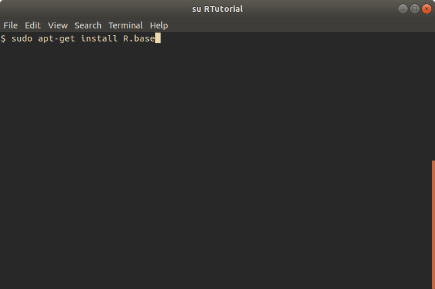
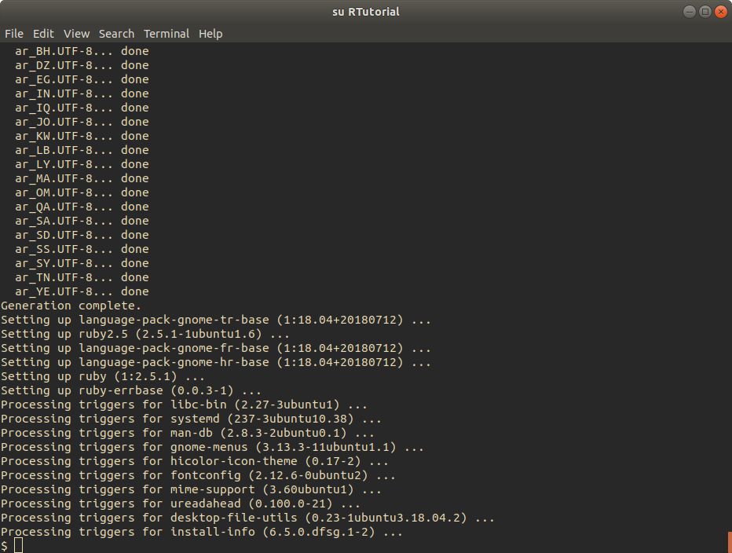

# Working environment

Some definitions before beginning:

* **R** is a **programming language**, designed specifically for statistical
computing. R can be run from the command line (a terminal), or from
within an IDE.
* **RStudio** is an **Integrated Development Environment** (**IDE**). An IDE
is a piece of software to provide a simpler user interface with all of the
associated tools a programmer might need while developing software (e.g. a
text editor, a compiler to construct a program from code, etc.).

If you have little to no programming experience, or if you prefer an IDE for
development, then RStudio is recommended.

### R installation (Linux)

To install R on Linux, enter the command `sudo apt-get install R.base`, and
enter your root password.

After entering 'Y' to install, all of the packages required for R will be
installed along with R:

