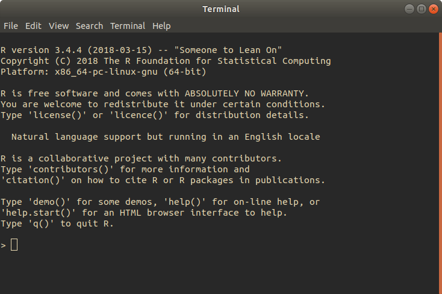

# Working environment

Some definitions before beginning:

* **R** is a **programming language**, designed specifically for statistical
computing. R can be run from the command line (a terminal), or from
within an IDE.
* **RStudio** is an **Integrated Development Environment** (**IDE**). An IDE
is a piece of software to provide a simpler user interface with all of the
associated tools a programmer might need while developing software (e.g. a
text editor, a compiler to construct a program from code, etc.).

If you have little to no programming experience, or if you prefer an IDE for
development, then RStudio is recommended.

### R installation

**Linux**: To install R on Linux, enter the command
`sudo apt-get install R.base`, and enter your root password.

Alternatively, you can go to the [R website](https://www.r-project.org/),
click download at the top left, and select your OS.

On Linux, you can now run R from the command line with `R`.
On Windows you can search for R from the windows search bar to open an instance
of R.

### Running the R console

##### First commands

R can be run by itself, and upon opening you'll see a screen similar to
this:



This is the R console, where we can enter R commands that will be interpreted
to give us output.

A few basic commands to try out could be:

* `getwd()` - Returns the current working directory (the directory/folder that
the R console is currently working from).
* `setwd(dir)` - `setwd(dir)` takes what is known as an **argument**, in this
case `dir`. An argument is data that we pass to a function/command that it will
use in some way. `dir` in this case is the directory that we want to set as our
new working directory.

In R, many functions have multiple arguments, which often have **default
values**. If an argument has a default value, then you can omit these arguments
when calling the function, and the default value will be used in its place.

* `help(topic)` - `help()` is an example of a function with several default
values. Try `help(setwd)` to retrieve information about the `getwd` and `setwd`
commands (press `q` to exit the help screen). Then, try `help(help)` to see
all the default values for `help`'s arguments.

If you ever are struggling to make a function work the way you expect it to,
it is always worth checking it's help page with `help(topic)`.

##### Basic calculations

While using the R console, we can perform numerous mathematical functions. To
begin with, try entering a few simple calculations:

* `3 + 3` - (addition) will output 6.
* `3 - 2` - (subtraction) will output 1.
* `3 / 2` - (division) will output 1.5.
* `3 * 3` - (multiplication) will output 9.
* `2 ^ 4` - (raise to power of) will output 16. (`2 ** 4` is equivalent)
* `7 %% 3` - (modulo) will output 1. (modulo is the remainder following
  division)
* `7 %/% 3` - (integer divide) will output 2.

These operators are capable of acting in the same manner as a basic calculator,
but they are much more powerful when applied to *vectors*, as we shall see
later.

##### Introducing variables

**Variables** are an essential part of most programming languages. A variable
simply **stores a value** under a convenient name.

In the R console, let's imagine we want to store the number of apples we own,
this can be done like so:

```
> apples <- 20
```

We will not see any output from this command. However, if we now enter a new
command: `ls()`, we will see "apples" listed.

`ls()` stands for **List Objects**, it can list the objects in any environment
in R (an environment can be thought of as an individual workspace within R,
where each environment can contains its own variables).
With no argument, it defaults to the default environment, which is the
one we have been using.

If we now enter `apples` into the command line, we receive `[1] 20` as output.
We can now use `apples` in any equation, and the number that we have stored
in this variable will be used.

* `apples * 3` will return 60.
* `apples / 5` will return 4.

We can declare as many variables as we want to in our R environment, and use
them in equations with one another. Try:

```
> bananas <- 3
> apples * bananas
[1] 60
```

To remove a variable once we no longer need it, we can use `rm(variable)` to
remove it from our environment.

To remove several variables, simply supply them to `rm()` as arguments
separated by commas: `rm(variable1, variable2)`.

To remove all variables in our environment, `rm(list=ls())` is a single command
that combines two functions and a variable assignment to clear our entire
environment.

##### Variable types

Most programming languages feature different types of variable, and R is no
different. These types are:

* character - used for characters ('a', 'b', 'c') and strings ("abc", "def"). If
you are new to programming, a string is essentially a number of characters lined
up next to each other. Many languages treat characters and strings as different
data types, but in R they are treated as a single type.
* numeric - Also known as *double*, numbers that may have decimal place values
e.g. 2.5, 15.35 etc.
* integer - Whole numbers e.g. 2, 5, etc. When declared, must be done with
suffixed by an **L** to specify that it is an integer value (var <- 2L).
* logical: TRUE and FALSE
* complex: 2 + 3i; complex numbers with real and imaginary parts.
* raw

Raw data type will not be covered here.

**Types** are essential, as many operations are not permitted on certain types.
Addition of doubles and integers for example is perfectly valid, but addition
of character strings is not accepted.

Let's determine the type of our variables declared before
(`apples` and `bananas`), and compare it to an integer type variable `oranges`
and a character type variable `name`.
We can do this with the `typeof` function.

```
> oranges <- 5L
> name <- "Alex"
>
> typeof(apples)
[1] "double"
> typeof(bananas)
[1] "double"
> typeof(oranges)
[1] "integer"
> typeof(name)
[1] "character"
```

##### Introducing Data structures

Many **data structures** exist within R, they form the backbone of R.


Link for RStudio: https://rstudio.com/products/rstudio/download/
Links:
https://www.datamentor.io/r-programming/vector/
https://swcarpentry.github.io/r-novice-inflammation/13-supp-data-structures/
https://www.dummies.com/programming/r/how-to-do-basic-arithmetic-in-r/
https://www.google.com/search?client=ubuntu&channel=fs&q=what+is+a+vector+in+r&ie=utf-8&oe=utf-8k
